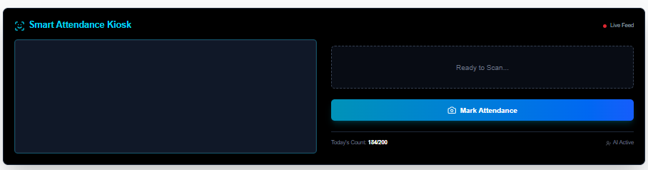
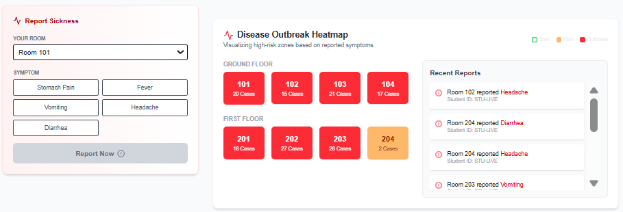

# 🛡️ HostelGuard AI: The Future of Smart Campus Living


> **A Full-Stack AI Ecosystem optimizing Food Sustainability, Health Safety, and Operational Efficiency for modern campuses.**


---

## 💡 The Problem
Traditional hostel management is reactive and inefficient:
1.  **Food Wastage:** Tons of food is wasted daily due to poor attendance estimation.
2.  **Health Risks:** Disease outbreaks (like food poisoning) are detected too late.
3.  **Manual Operations:** Complaints are ignored, and menu planning is unscientific.

## 🚀 The Solution: HostelGuard
HostelGuard is a 3-tier AI system that acts as the **Brain (Prediction)**, **Heart (Health)**, and **Wallet (Cost Savings)** of the campus.

---

## 🔥 Key Features

### 1. 🥘 AI Zero-Waste Kitchen (Machine Learning)
* **Predictive Engine:** Uses a **Random Forest Regressor** trained on 1500+ days of data.
* **Smart Logic:** Analyzes Menu, Weather, and Day to predict exact food requirement (kg).
* **Impact:** Reduces food wastage by up to **40%**, saving thousands of rupees monthly.

### 2. 🤖 GenAI Menu Architect (Google Gemini)
* **Auto-Chef:** Generates weekly dinner menus using **Generative AI**.
* **Smart Context:** Looks at past wastage data (e.g., "Students hate Tinda") to suggest nutritious, cost-effective alternatives.

### 3. 🏥 Real-Time Health War Room
* **Live Heatmap:** Visualizes hostel rooms on a dynamic map.
* **Outbreak Detection:** Automatically flags rooms as **RED ZONES** if >3 students report similar symptoms (e.g., Vomiting) in real-time.

### 4. 🗣️ NLP Smart Complaint Box
* **Sentiment Analysis:** Uses **Natural Language Processing (TextBlob)** to read student complaints.
* **Auto-Triage:** Automatically tags issues (e.g., "Hygiene", "Emergency") and highlights urgent cases for the Warden.

### 5. 👁️ Vision-Based Attendance UI
* **Face Scan Interface:** A futuristic, sci-fi styled webcam interface for marking attendance.
* **Proxy-Proof:** Designed to replace manual register entries.

### 6. ♻️ Sustainable Leftover Recycler
* **Circular Economy:** Suggests creative recipes to reuse leftovers (e.g., *Rice -> Lemon Rice*) instead of dumping them.

---

## 🏗️ System Architecture

 The project follows a robust **Microservices-inspired Monorepo** structure:

| Service | Port | Tech Stack | Responsibility |
| :--- | :--- | :--- | :--- |
| **Client** | `3000` | Next.js, Tailwind, Recharts | User Interface & Dashboards |
| **Server** | `5000` | Node.js, Express, Mongoose | API Gateway, Auth, DB Management |
| **ML Engine** | `8000` | Python, Flask, Scikit-Learn | AI Inference & NLP Processing |

---
## 📂 Folder Structure

The project maintains a clean separation of concerns using a monorepo structure:

```text
hostelguard/
├── client/                     # Frontend (Next.js)
│   ├── src/
│   │   ├── app/                # Next.js App Router (page.tsx, layout.tsx)
│   │   └── components/         # UI Components (Dashboard, Widgets, Login)
│   ├── public/                 # Static assets
│   └── package.json            # Frontend dependencies
│
├── server/                     # Backend API (Node.js + Express)
|   ├── config/                 # Connect MongoDB
│   ├── models/                 # MongoDB Schemas (MessLog, Complaint)
│   ├── routes/                 # API Routes (aiRoutes, healthRoutes)
│   ├── index.js                # Server entry point
│   └── package.json            # Backend dependencies
│
├── ml_engine/                  # AI & NLP Microservice (Python)
│   ├── data/                   # Generated synthetic datasets (CSV)
│   ├── models/                 # Trained Random Forest models (.pkl)
│   ├── generate_better_data.py # Script for logic-based data generation
│   ├── train_model.py          # Script to train and save the ML model
│   ├── app.py                  # Flask server for AI inference & NLP
│   └── requirements.txt        # Python dependencies
│
└── README.md                   # Project documentation


## 🛠️ Installation & Setup

### Prerequisites
* Node.js & npm installed
* Python 3.8+ installed
* MongoDB running locally

### 1. Clone the Repository

git clone [https://github.com/yourusername/hostelguard.git](https://github.com/yourusername/hostelguard.git)
cd hostelguard

2. Backend Setup (Node.js)

cd server
npm install
# Create a .env file with PORT=5000, MONGO_URI, and GEMINI_API_KEY
npm run dev

3. AI Engine Setup (Python)

cd ml_engine
python -m venv venv
source venv/bin/activate  # or venv\Scripts\activate on Windows
pip install -r requirements.txt
python app.py

4. Frontend Setup (Next.js)

cd client
npm install
npm run dev

Visit http://localhost:3000 to access the application.📸 

Screenshots
Admin Dashboard


Visualize complex data & cost insights

Smart Login System


 Role-based access for Students/Admins
 
 AI Prediction
 
 
 ML-based food waste forecasting

 Health Heatmap
 
 
 Real-time disease outbreak tracking
 
 🔮 Future Roadmap
 IoT Integration: Smart dustbins to weigh waste automatically.

 Mobile App: React Native app for students on the go.

 Blockchain: Supply chain transparency for food raw materials.

 👨‍💻Contributors
 Bikash Samanta - Full Stack & AI Developer
 
 Built with ❤️ and ☕ for a sustainable future.
